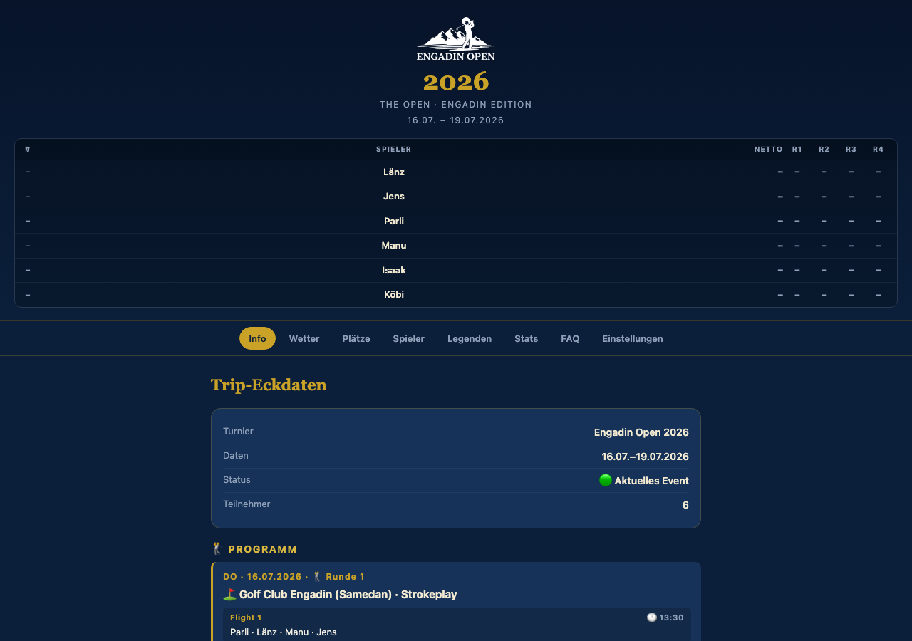
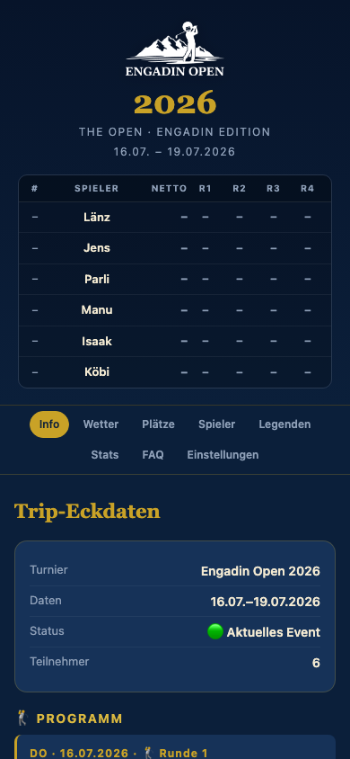

# Engadin Open

Companion-App für das **Engadin Open** — ein jährliches Golf-Turnier unter Freunden in der Schweizer Engadin-Region. Die App läuft als Progressive Web App (PWA) und liefert Echtzeit-Scores, Ranglisten, Statistiken und Turnierinformationen direkt auf dem Smartphone.

**Live:** [engadin-open-2026.vercel.app](https://engadin-open-2026.vercel.app)

---

## Screenshots

### Desktop



### Mobile



---

## Features

| Tab | Inhalt |
|---|---|
| **Info** | Live-Rangliste, Turnierprogramm, Flights, Trip-Eckdaten |
| **Wetter** | Aktuelles Wetter für den Spielort |
| **Plätze** | Platzinfos, Lochübersicht, Pars & Stroke-Index |
| **Spieler** | Profile mit Handicap, Foto und persönlichem Slogan |
| **Legenden** | Hall of Fame, Chronik und Sieger vergangener Jahre |
| **Stats** | Detailstatistiken mit Charts: Scoring, Putting, GIR, Scrambling, Rundenverläufe |
| **FAQ** | Regeln, Wertungsformat, häufige Fragen |
| **Einstellungen** | Spielerauswahl, Dark Mode, Push-Notifications |

**Score-Erfassung:** Schläge, Putts und verlorene Bälle pro Loch via interaktivem Scoresheet direkt in der App.

**Statistiken:** Ø Putts/Loch, 1-Putt-%, 3-Putt-% (inkl. unnötige Putts), GIR, Scrambling, Birdie-/Par-/Bogey-Verteilung, Vergleich nach Pars und Platzhälften.

**PWA:** Installierbar auf iOS und Android, funktioniert offline für gecachte Inhalte.

---

## Tech Stack

| Schicht | Technologie |
|---|---|
| Frontend | Vanilla HTML/CSS/JS (Single Page App) |
| Backend | Vercel Serverless Functions (Node.js) |
| Datenbank | Vercel KV (Redis) |
| Hosting | Vercel |
| Daten | `data/<year>.json` pro Turnierjahr |

---

## Projektstruktur

```
├── index.html              # Gesamte Frontend-App (SPA)
├── api/                    # Vercel Serverless Functions
│   ├── scores.js           # Score-Erfassung und -Abruf
│   ├── players.js          # Spielerverwaltung
│   ├── results.js          # Ergebnisberechnung
│   ├── stats.js            # Statistik-Endpunkt
│   ├── notify.js           # Push Notifications
│   ├── track.js            # Live-Tracking
│   └── ...
├── data/
│   └── <year>.json         # Spieler, Plätze, Spielplan pro Jahr
└── manifest.webmanifest    # PWA-Manifest
```

---

## Lokale Entwicklung

```bash
npm install
vercel dev
```

Benötigt eine `.env.local` mit den Vercel KV-Zugangsdaten (via `vercel env pull`).

---

## Deployment

```bash
vercel --prod
```

Jedes Jahr wird ein neues Turnierjahr in `data/<year>.json` angelegt. Der `DEFAULT_YEAR`-Schlüssel in den Umgebungsvariablen steuert das aktive Jahr.
